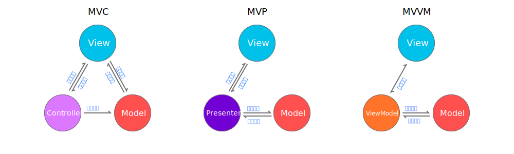

首先来看一下Android工程结构的进化：

- ### 基本结构

MVVM从结构上来说和MVP比较相似，前者仅仅是View和ViewModel之间实现了数据的双向绑定。但这一结构的更改使得整个工程的布局发生了变化，MVVM实际上是建立了一条从用户->服务器->用户的可监听的数据流。Google的Android Architecture Components就是用来实现这样一条数据流的。

- ### MVVM工程结构

    1. ViewModel 
    ViewModel是MVVM的核心，通过ViewModel，View和Data实现了双向绑定，